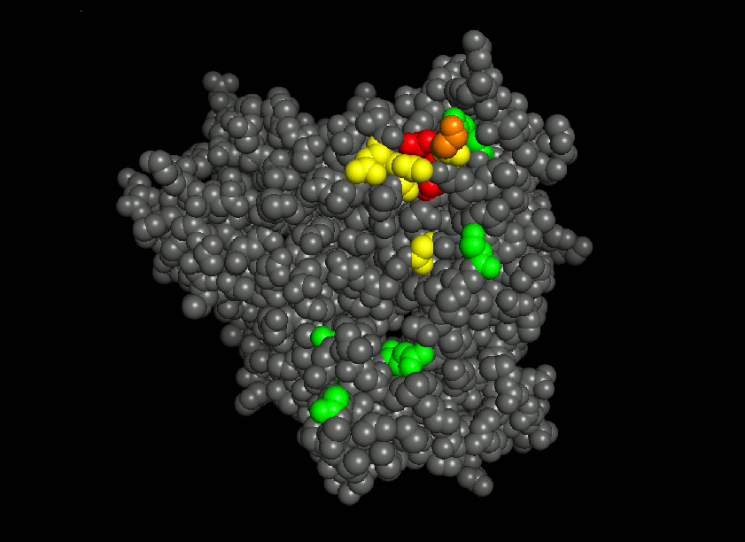

# Welcome {-}

The [`slapnap`](https://hub.docker.com/r/slapnap/slapnap) container is a tool for using the Compile, Analyze and Tally NAb Panels (CATNAP) database to develop predictive models of HIV-1 neutralization sensitivity to one or several broadly neutralizing antibodies (bNAbs). 

Crystal structure of HIV-1 gp120 glycoprotein. Highlighted residues indicating sites most-predictive of VRC01 neutralization resistance. [@magaret2019prediction]

In its simplest form, `slapnap` can be used simply to access and format data from CATNAP in a way that is usable for machine learning analysis. However, the tool also offers fully automated and customizable machine learning analyses based on up to five different neutralization endpoints, complete with automated report generation to summarize results and identify the most predictive features. 

This document serves as the user manual for the `slapnap` container. Here, we describe everything needed to utilize the `slapnap` container and understand its output. The documentation is organized into the following sections:
	
* Section \@ref(sec:docker) provides a brief overview of Docker, including information on installing Docker and downloading the `slapnap` container.
* Section \@ref(sec:catnap) provides a brief overview of the CATNAP database and the specifics of how the data were accessed to build the `slapnap` container. 
* Section \@ref(sec:runningcontainer) provides a detailed description of how to make calls to the slapnap repository, including descriptions of all options that are available.
* Section \@ref(sec:examples) includes several example calls to the `slapnap` container and descriptions of their output.
* Section \@ref(sec:data) provides a description of the data set created in the `slapnap` container. 
* Section \@ref(sec:methods) provides an overview of the methodology that is used in within the `slapnap` analysis. 

If you have any issues or questions about using `slapnap`, please [file an issue](https://github.com/benkeser/slapnap/issues) on GitHub. 
